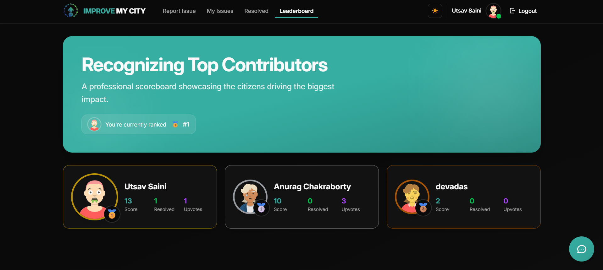
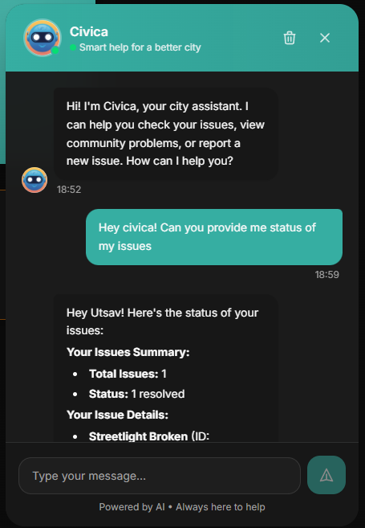
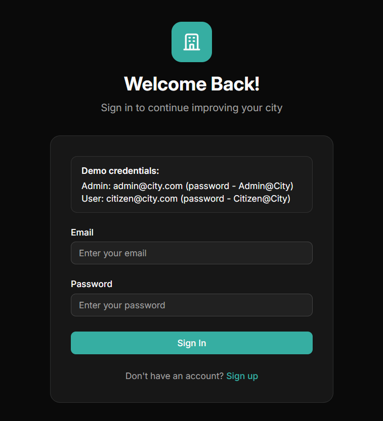

# Improve My City - Frontend

A web application that allows citizens to report, track, and view resolutions of civic issues in their neighborhood. Built with React, TypeScript, and Tailwind CSS.

## Prerequisites

- Node.js (v16 or higher)
- npm or yarn

## Setup

1. Install dependencies:
```bash
npm install
```

2. Create a `.env` file in the root directory (if needed):
```env
VITE_API_URL=http://localhost:3000/api
```

## Running the Application

Start the development server:
```bash
npm run dev
```

The application will open at `http://localhost:5173`

## Build for Production

```bash
npm run build
```

## Features & Pages

### Home Page


- **All Issues Dashboard**: View all reported civic issues in your area
- **Statistics Overview**: Total, pending, in-progress, resolved, and closed issues count
- **Advanced Filters**: Filter by category (Pothole, Garbage, Streetlight, etc.) and location
- **View Modes**: Switch between grid and table view
- **Pagination**: Browse through issues with page navigation
- **Issue Interactions**: View **upvotes**, **comments**, and issue status
- **Real-time Updates**: Auto-refresh issues every 30 seconds

### Report Issue Page


- **Issue Submission**: Report new civic issues with detailed information
- **Category Selection**: Choose from issue categories
- **Location Picker**: Select location via interactive search or current location
- **Image Upload**: Upload multiple images (up to 5) with preview
- **Address Autocomplete**: Search and select locations with suggestions

### My Issues Page


- **Personal Dashboard**: View all issues reported by you
- **Status Filtering**: Filter by Pending, In Progress, Resolved, or Closed
- **Category Filtering**: Filter by specific issue categories
- **Sorting Options**: Sort by newest, oldest, or most popular
- **View Modes**: Grid or table view for better visualization
- **Quick Actions**: Edit or delete your reported issues
- **Issue Statistics**: Track your contribution to the community

### Resolved Issues Page


- **Success Stories**: View all successfully resolved civic issues
- **Community Impact**: See the positive changes in your neighborhood
- **View Modes**: Browse resolved issues in grid or table format
- **Detailed Information**: Resolution messages and before/after images
- **Inspiration**: Motivate others to report and track issues

### Leaderboard Page



- **Top Contributors**: View rankings of most active community members
- **User Statistics**: See total reports, upvotes received, and resolved issues
- **Badge System**: Earn badges like Legend, Hero, Champion, Rising Star, Reporter Pro
- **Points System**: Track engagement points and community contribution
- **Time Filters**: View leaderboard for all-time, monthly, or weekly periods
- **Personal Ranking**: Find your position and compare with others
- **Detailed Stats Modal**: Click users to view detailed contribution statistics

### Admin Dashboard Page


- **Issue Management**: View and manage all reported issues (admin only)
- **Status Updates**: Change issue status (Pending, In Progress, Resolved, Closed)
- **Priority Assignment**: Set priority levels (Low, Medium, High, Critical)
- **Issue Resolution**: Add resolution messages and upload resolution images
- **Sorting & Filtering**: Sort by title, date, upvotes, priority, or status
- **Admin Controls**: Full control over issue lifecycle

### AI Chatbot (Civica)

<div align="center">
  
</div>



- **Smart Assistant**: AI-powered chatbot to help using the platform
- **Natural Conversations**: Ask questions in plain language about your issues
- **Quick Actions**: Check your reported issues, view community problems
- **Issue Reporting**: Report new issues directly through chat conversation
- **Conversation History**: Maintains chat history for seamless experience
- **24/7 Availability**: Always ready to assist with civic reporting

### Login Page



- **User Authentication**: Secure login with email and password
- **Registration Link**: Quick access to create a new account

### Register Page


- **New Account Creation**: Sign up with name, email, and password

## Tech Stack

- React 19
- TypeScript
- Tailwind CSS 4
- React Router v7
- Vite
- Zustand (State Management)
